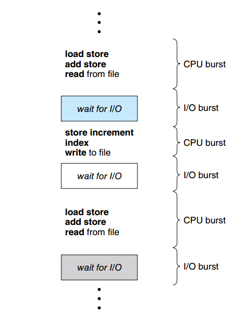
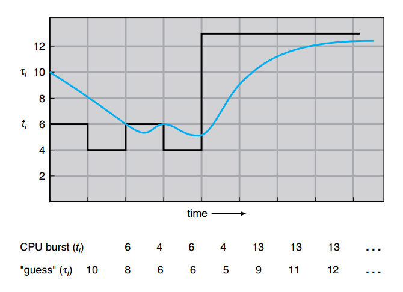
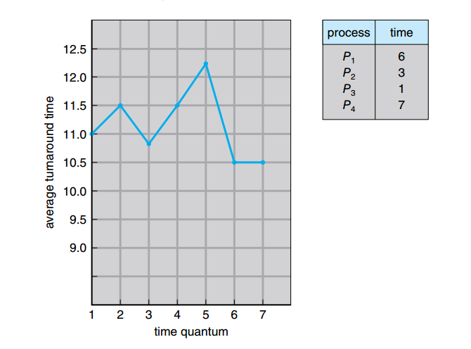
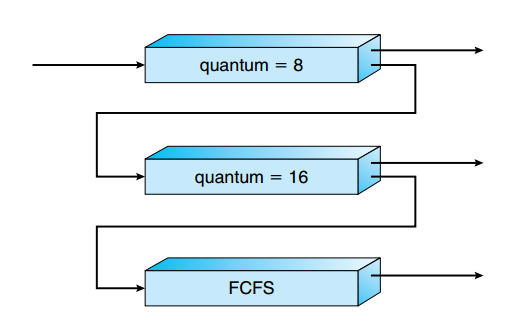
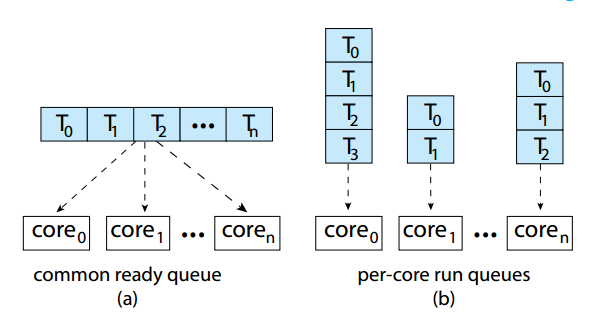
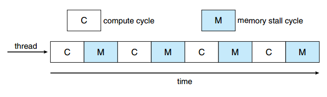
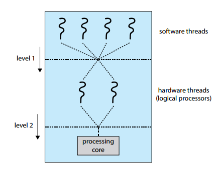
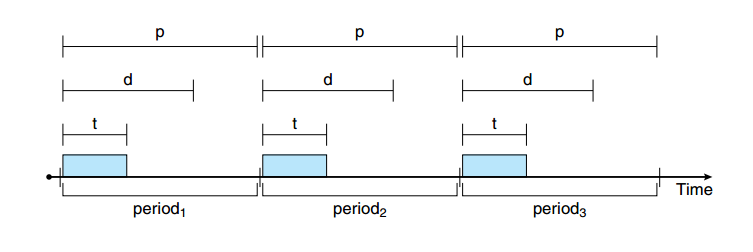

# CPU Scheduling

## Basic Concepts

**What is CPU Scheduling?**
CPU scheduling determines which process from the **ready queue** (processes ready to execute) gets the CPU. In multiprogramming, multiple processes compete, and the scheduler ensures efficient CPU use. The CPU executes one process per core at a time, switching via **context switches** (saving/restoring process state).

- **Key Concepts**:
  - **CPU Burst**: Time a process uses the CPU (e.g., computations).
  - **I/O Burst**: Time a process waits for I/O (e.g., disk access).
  - **Preemptive Scheduling**: The OS can interrupt a running process to reallocate the CPU (e.g., for a higher-priority process).
  - **Non-preemptive Scheduling**: The running process keeps the CPU until it blocks or terminates.
  - **Dispatcher**: Transfers control to the selected process, handling context switches.

- **Example**: Consider three processes on your Ubuntu system:
  - **P1**: A compiler (CPU-intensive, long CPU bursts).
  - **P2**: A text editor (I/O-bound, frequent I/O bursts for input).
  - **P3**: A video player (mixed, CPU for decoding, I/O for streaming).
  - The scheduler prioritizes based on bursts. Run `top` to observe switching (press `f`, enable `STATE` to see R for running, S for sleeping).

|  |
|:--:|
| **Figure 5.1**: This diagram shows alternating CPU and I/O bursts in a process’s execution, like a timeline: CPU burst (shaded) → I/O burst (unshaded) → CPU burst. It highlights P1’s long CPU bursts vs. P2’s short CPU bursts with frequent I/O. |
  
- **Why It Matters**: Scheduling maximizes CPU utilization and balances responsiveness (e.g., P2’s typing) with throughput (e.g., P1’s compilation). Context switches add overhead, so schedulers optimize frequency.

- **Ubuntu Tip**: Install `htop` (`sudo apt install htop`) for a visual CPU usage breakdown. Press `F5` to see process trees, showing how the scheduler manages P1, P2, P3. I/O-bound processes (like editors) get quick CPU access.

**Exam Note**: Master CPU vs. I/O bursts and preemptive vs. non-preemptive scheduling. Explain context switch overhead.

## Scheduling Criteria

**How Do We Evaluate Schedulers?**
Schedulers are evaluated using performance metrics, balancing user experience and system efficiency:

- **CPU Utilization**: Percentage of time the CPU is busy (ideal: 100%).
- **Throughput**: Number of processes completed per unit time.
- **Turnaround Time (Tt)**: Time from submission to completion (Tt = tf - te).
- **Waiting Time (tw)**: Time in the ready queue (tw = Tt - ts).
- **Response Time**: Time from submission to first CPU execution (key for interactive apps).
- **Normalized Turnaround Time (Tt/ts)**: Turnaround time divided by service time, measuring efficiency.

- **Example**: On Ubuntu:
  - **P1**: Backup script (batch, needs high throughput).
  - **P2**: Firefox (interactive, needs low response time).
  - **P3**: Database server (balanced needs).
  - Prioritizing P2 reduces response time but may delay P1’s throughput. Metrics quantify trade-offs.

- **Optimization Challenge**: Maximizing utilization/throughput often increases waiting/turnaround times. Schedulers adapt to system goals (e.g., desktop vs. server).

- **Ubuntu Tip**: Use `ps -aux | grep [process]` to check CPU time (`TIME` column) and state. High waiting time for P1 in `top` indicates a scheduler favoring P2.

**Exam Note**: Memorize the five criteria and their definitions. Discuss trade-offs (e.g., throughput vs. response time).

## Scheduling Algorithms

**How Does the Scheduler Choose?**
This section explores scheduling algorithms, each with distinct strategies. We use an abstract example with three processes: **P1**, **P2**, **P3**, with attributes (all arrive at te = 0ms):

| Process | te (ms) | ts (ms) |
|---------|---------|---------|
| P1      | 0       | 24      |
| P2      | 0       | 3       |
| P3      | 0       | 3       |

We calculate **tf**, **Tt**, **Tt/ts**, and **tw** for each algorithm, presented in code blocks.

- **First-Come, First-Served (FCFS)**:
  - **How**: Non-preemptive, processes run in arrival order (like a store queue).
  - **Execution**: P1 (24ms), P2 (3ms), P3 (3ms).
  - **Calculations**:
    ```plaintext
    P1: tf = 24, Tt = 24 - 0 = 24, tw = 24 - 24 = 0, Tt/ts = 24/24 = 1
    P2: tf = 27, Tt = 27 - 0 = 27, tw = 27 - 3 = 24, Tt/ts = 27/3 = 9
    P3: tf = 30, Tt = 30 - 0 = 30, tw = 30 - 3 = 27, Tt/ts = 30/3 = 10
    Average: tw = (0 + 24 + 27)/3 = 17ms, Tt = (24 + 27 + 30)/3 = 27ms
    ```
  - **Pros**: Simple, fair for equal-priority processes.
  - **Cons**: Long waiting times if a long process (P1) runs first (**convoy effect**).
  - **Figure 5.4**:
    
    
    
    This Gantt chart shows P1 (0-24ms), P2 (24-27ms), P3 (27-30ms), illustrating P2 and P3 waiting for P1.

- **Shortest-Job-First (SJF)**:
  - **How**: Non-preemptive, selects the process with the shortest ts (can be preemptive as **Shortest-Remaining-Time-First**).
  - **Execution**: P2 (3ms), P3 (3ms), P1 (24ms).
  - **Calculations**:
    ```plaintext
    P2: tf = 3, Tt = 3 - 0 = 3, tw = 3 - 3 = 0, Tt/ts = 3/3 = 1
    P3: tf = 6, Tt = 6 - 0 = 6, tw = 6 - 3 = 3, Tt/ts = 6/3 = 2
    P1: tf = 30, Tt = 30 - 0 = 30, tw = 30 - 24 = 6, Tt/ts = 30/24 = 1.25
    Average: tw = (0 + 3 + 6)/3 = 3ms, Tt = (3 + 6 + 30)/3 = 13ms
    ```
  - **Pros**: Minimizes average waiting time (optimal for non-preemptive).
  - **Cons**: Needs ts prediction; long jobs (P1) may starve.
  - **Figure 5.6**:
  
    
    
    Gantt chart shows P2 (0-3ms), P3 (3-6ms), P1 (6-30ms), highlighting shorter jobs first.

- **Priority Scheduling**:
  - **How**: Each process has a priority (lower number = higher priority); highest priority runs. Assume P2 (priority 1), P1 (priority 2), P3 (priority 3).
  - **Execution**: P2 (3ms), P1 (24ms), P3 (3ms).
  - **Calculations**:
    ```plaintext
    P2: tf = 3, Tt = 3 - 0 = 3, tw = 3 - 3 = 0, Tt/ts = 3/3 = 1
    P1: tf = 27, Tt = 27 - 0 = 27, tw = 27 - 24 = 3, Tt/ts = 27/24 = 1.125
    P3: tf = 30, Tt = 30 - 0 = 30, tw = 30 - 3 = 27, Tt/ts = 30/3 = 10
    Average: tw = (0 + 3 + 27)/3 = 10ms, Tt = (3 + 27 + 30)/3 = 20ms
    ```
  - **Pros**: Prioritizes critical tasks (e.g., P2 as a system process).
  - **Cons**: Low-priority processes (P3) may starve without **aging** (increasing priority over time).
  - **Ubuntu Tip**: Use `nice -n 10 firefox` to lower Firefox’s priority, or `renice 10 -p [pid]` for running processes. Check in `htop` (NI column).

- **Round-Robin (RR)**:
  - **How**: Preemptive, each process gets a **time quantum** (e.g., 10ms), then switches.
  - **Execution**: Quantum = 10ms. P1 (10ms), P2 (3ms, done), P3 (3ms, done), P1 (10ms), P1 (4ms).
  - **Calculations**:
    ```plaintext
    P1: tf = 27, Tt = 27 - 0 = 27, tw = 27 - 24 = 3, Tt/ts = 27/24 = 1.125
    P2: tf = 13, Tt = 13 - 0 = 13, tw = 13 - 3 = 10, Tt/ts = 13/3 = 4.33
    P3: tf = 23, Tt = 23 - 0 = 23, tw = 23 - 3 = 20, Tt/ts = 23/3 = 7.67
    Average: tw = (3 + 10 + 20)/3 = 11ms, Tt = (27 + 13 + 23)/3 = 21ms
    ```
  - **Pros**: Fair, ideal for time-sharing (Ubuntu’s desktop).
  - **Cons**: High context-switch overhead if quantum is too small.
  - **Figure 5.9**:
  - 
    
    
    Gantt chart shows P1 (0-10), P2 (10-13), P3 (13-16), P1 (16-26), P1 (26-27), showing time-sliced execution.

- **Multilevel Queue**:
  - **How**: Multiple queues with different priorities (e.g., foreground for interactive, background for batch). Each queue uses its own algorithm (e.g., RR for foreground, FCFS for background).
  - **Example**: P2 (Firefox) in foreground queue (RR, 10ms quantum), P1 (backup) in background (FCFS). P2 gets more CPU initially.
  - **Figure 5.11**:
  
    
    
    Diagram shows two queues: foreground (RR) and background (FCFS), with processes assigned by type.
    
  - **Ubuntu Tip**: Ubuntu’s CFS mimics this by prioritizing interactive tasks. Check with `schedtool -v [pid]`.

- **Multilevel Feedback Queue**:
  - **How**: Like multilevel queue, but processes move between queues based on CPU usage. High-priority queues have short quanta; CPU-heavy processes drop to lower queues.
  - **Example**: P2 starts in high-priority queue (RR, 10ms). If it uses full quantum, it drops to a lower queue (RR, 20ms). P1 (CPU-heavy) stays in low-priority queue.
  - **Pros**: Adapts to process behavior (interactive vs. batch).
  - **Cons**: Complex to tune parameters.
  - **Figure 5.12**:
  
    
    
    Shows three queues with increasing quanta (8ms, 16ms, FCFS), with arrows indicating process movement.

**Ubuntu Insight**: Ubuntu’s **Completely Fair Scheduler (CFS)** resembles a multilevel feedback queue, adjusting priorities via **virtual runtime**. Run `cat /proc/sched_debug` (sudo) to see task priorities and runtimes.

**Exam Note**: Practice Gantt charts and calculations for FCFS, SJF, Priority, and RR. Understand starvation and aging in priority scheduling.

## Thread Scheduling

**Scheduling Threads, Not Just Processes**
Modern systems schedule **threads** (lightweight processes within a process). Two models:

- **User-Level Threads (ULTs)**: Managed by a thread library (e.g., Java’s Thread class). The kernel sees one process, limiting parallelism.
- **Kernel-Level Threads (KLTs)**: Kernel schedules each thread, enabling parallelism but with higher overhead.

- **Example**: A Python web server on Ubuntu (`threading` module) uses KLTs via Pthreads. Each thread (handling a client) is scheduled independently. Run `ps -eL | grep python` to see threads (TID column).

- **Scheduling Models**:
  - **Many-to-One**: Multiple ULTs map to one KLT (no parallelism).
  - **One-to-One**: Each ULT maps to a KLT (Ubuntu’s default for Pthreads).
  - **Many-to-Many**: Multiple ULTs map to multiple KLTs, balancing flexibility.

- **Ubuntu Tip**: In `htop`, press `H` to show threads. See how a multi-threaded app (e.g., `apache2`) spreads across CPUs. Adjust with `schedtool -r -p 20 [tid]`.

**Exam Note**: Know ULT vs. KLT, and why KLTs are preferred for multicore systems.

## Multi-Processor Scheduling

**Scheduling on Multicore Systems**
Multicore CPUs (common in Ubuntu) require advanced scheduling:
- **Symmetric Multiprocessing (SMP)**: Each core has a scheduler, sharing memory. **Load balancing** prevents idle cores.
- **NUMA (Non-Uniform Memory Access)**: Memory access time varies by core. Schedulers prefer local memory.
- **Approaches**:
  - **Homogeneous**: Identical cores (e.g., Intel i7). Threads run anywhere.
  - **Heterogeneous**: Different cores (e.g., ARM big.LITTLE). Schedulers assign tasks to suitable cores.

- **Example**: On a quad-core Ubuntu system, compiling (`make -j4`) spawns threads across cores. The scheduler balances them, considering NUMA on servers.
- **Calculations**: Two cores, three threads (P1: 24ms, P2: 3ms, P3: 3ms). Core 1 runs P1, Core 2 runs P2 then P3.
  ```plaintext
  P1: tf = 24, Tt = 24, tw = 0, Tt/ts = 24/24 = 1
  P2: tf = 3, Tt = 3, tw = 0, Tt/ts = 3/3 = 1
  P3: tf = 6, Tt = 6, tw = 3, Tt/ts = 6/3 = 2
  Average: tw = (0 + 0 + 3)/3 = 1ms, Tt = (24 + 3 + 6)/3 = 11ms
  ```
- **Figure 5.15**:

  
  
  Diagram shows a thread moving from a busy core to an idle one, illustrating load balancing.

- **Ubuntu Tip**: Use `taskset -c 0-3 make` to pin compilation to all cores, or `taskset -c 0 make` to one core. Compare speed with `time`. Check cores in `htop` (press `F2`, enable CPU meters).

**Exam Note**: Understand SMP vs. NUMA, load balancing, and heterogeneous scheduling.

## Real-Time CPU Scheduling

**Scheduling for Time-Critical Tasks**
Real-time systems prioritize predictable timing:
- **Soft Real-Time**: Prioritizes critical tasks (e.g., Ubuntu’s PulseAudio).
- **Hard Real-Time**: Must meet deadlines (e.g., industrial control).
- **Algorithms**:
  - **Rate-Monotonic (RM)**: Static priorities by task period (shorter = higher).
  - **Earliest-Deadline-First (EDF)**: Dynamic priorities by closest deadline.

- **Example**: An Ubuntu audio app (Ardour) needs soft real-time. EDF ensures the audio thread runs before buffer emptying. Tasks: P1 (ts=5ms, period=20ms), P2 (ts=10ms, period=50ms). EDF schedules P1 at t=0 (deadline 20ms), P2 at t=5 (deadline 50ms).
- **Calculations**:
  ```plaintext
  P1: tf = 5, Tt = 5, tw = 0, Tt/ts = 5/5 = 1
  P2: tf = 15, Tt = 15, tw = 5, Tt/ts = 15/10 = 1.5
  Average: tw = (0 + 5)/2 = 2.5ms, Tt = (5 + 15)/2 = 10ms
  ```
- **Figure 5.20**:

  
  
  Diagram shows EDF reordering tasks by deadline (e.g., P1 before P2).

- **Ubuntu Tip**: Set real-time priority with `chrt -r -p 50 [pid]` (sudo). Install `rt-tests` (`sudo apt install rt-tests`) and run `cyclictest` to measure latency.

**Exam Note**: Know RM vs. EDF, and soft vs. hard real-time.

## Operating-System Examples

**Scheduling in Real Systems**
- **Linux (Ubuntu)**: Uses **Completely Fair Scheduler (CFS)**, tracking **virtual runtime** (vruntime) for fairness. Tasks with lower vruntime get CPU time, mimicking multilevel feedback queues.
  - **Example**: Firefox (interactive) gets more CPU than a backup script (batch) due to lower vruntime.
  - **Ubuntu Tip**: Run `cat /proc/sched_debug` (sudo) to see vruntime. Use `schedtool -r -p 20 [pid]` for real-time.
- **Windows 10**: Preemptive, priority-based with 32 levels. Real-time tasks (16-31) override normal (0-15).
- **Solaris**: Multilevel feedback queue with dynamic priorities, similar to CFS.

**Exam Note**: Focus on Ubuntu’s CFS, vruntime, and fairness.

## Algorithm Evaluation

**Choosing the Best Algorithm**
Evaluation methods:
- **Deterministic Modeling**: Analyze with known ts (e.g., SJF’s 3ms tw).
- **Queueing Models**: Use probability for ts distributions (complex).
- **Simulation**: Run algorithms on sample workloads.
- **Implementation**: Test in a real system (accurate but costly).

- **Example**: Simulate RR vs. SJF on Ubuntu with a C program:
  - Spawn threads with ts = 24ms, 3ms, 3ms.
  - Measure tw using `gettimeofday()`.
  - Compare (SJF: 3ms, RR: 11ms).
- **Ubuntu Tip**: Use `stress-ng --cpu 4` to simulate workloads. Observe in `htop`. Compare FCFS vs. RR with `nice`.

**Exam Note**: Compare algorithms using tw and Tt from examples.

## Practice Exercises (Selected from p. 251-253)

- **5.1**: Why distinguish I/O-bound and CPU-bound programs?
  - **Answer**: I/O-bound programs (e.g., gedit) need quick response times, so schedulers prioritize them to minimize tw. CPU-bound programs (e.g., gcc) need long CPU bursts, so schedulers ensure they don’t starve. Ubuntu’s CFS favors I/O-bound tasks dynamically.

- **5.3**: Can turnaround time be negative?
  - **Answer**: No, Tt = tf - te, and tf ≥ te. Negative Tt implies time travel, which is impossible.

- **5.7**: SJF for P1(6ms), P2(3ms), P3(7ms), P4(1ms).
  - **Solution**: Order: P4(1ms), P2(3ms), P1(6ms), P3(7ms).
    ```plaintext
    P4: tf = 1, Tt = 1 - 0 = 1, tw = 1 - 1 = 0, Tt/ts = 1/1 = 1
    P2: tf = 4, Tt = 4 - 0 = 4, tw = 4 - 3 = 1, Tt/ts = 4/3 ≈ 1.33
    P1: tf = 10, Tt = 10 - 0 = 10, tw = 10 - 6 = 4, Tt/ts = 10/6 ≈ 1.67
    P3: tf = 17, Tt = 17 - 0 = 17, tw = 17 - 7 = 10, Tt/ts = 17/7 ≈ 2.43
    Average: tw = (0 + 1 + 4 + 10)/4 = 3.75ms, Tt = (1 + 4 + 10 + 17)/4 = 8ms
    ```
  - **Ubuntu Tip**: Write a C program with `fork()` and `sleep()` to simulate bursts, measure tw with `time`.

## Exam Tips
- **Memorize**: Algorithms (FCFS, SJF, Priority, RR, Multilevel), pros/cons, Gantt chart construction.
- **Practice**: Calculate te, ts, tf, Tt, tw, Tt/ts (e.g., Exercise 5.7).
- **Understand**: Preemption, starvation, aging, CFS, real-time scheduling.
- **Tools**: Use `htop`, `top`, `chrt`, `taskset`, `stress-ng` to explore Ubuntu’s scheduler.
